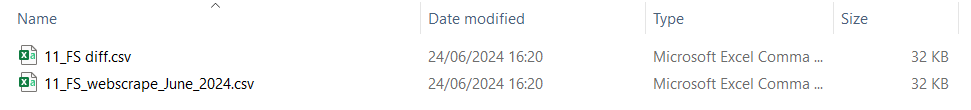

## Data
All the data is stored within the database folder, and this section explains what each folder is responsible for:

- [Output](#output)
- [Archives](#archives)
- [Logs](#logs)
- [Template.csv](#templatecsv)
- [company_metadata.csv](#company_metadatacsv)

### Output

The output folder will contain a folder for each company, and within that folder we will find the webscraped data + financial data, alongside a diff file as shown below:

  

This folder will always contain the most up-to-date data of the competitor - past data will be in the [Archives](#archives) folder. If there is no difference between past data and the most recent data, the diff file will not be produced.

The output folder also contains a file called *'price_report.csv'* containing a more detailed output of just the financial data for each company.

The final file in the output folder is called *'kubrick_mi_company_intel.csv'* containing information on a company including:

- Training Program Duration
- Anecdotal Reviews
- Consultant Pricing
### Archives

The archives folder will have a very similar structure to the output folder, with subsets of folders for each of the companies. This folder will never contain the diff file, but will contain the past profiling data for each companies.

### Logs

This log folder will keep a record of all the errors and any changes in the webscrape data. The lof of errors will be in *log_error.txt*, whereas the differences in webscrape will be stored in *log_diff.txt*. For a more technical overview of the console, the console error is also saved in *scrape_app.log*, in case the error requires further insight.

### Template.csv

This is an empty csv containing all the columns required to produce the profiling dataframe. **DO NOT** modify or remove this file.

### company_metadata.csv
This is a csv containing metadata about each company. The metadata includes:

- Company Name
- Company URL
- Status
- Ticker
- scraper

If a new company is to be added into the list, include it into this csv document, and also ensure that the new scraper function is in scrapers.py.