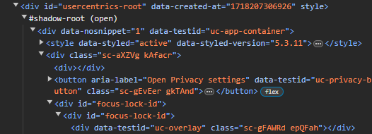

# Webscrape Help
## Overview
In this section help can be found for scraping, more specifically for cases where the standard GET rquest doesn't work.  

## Possible Issues
- 403 Error when printing soup or the status code for the request.  
- Request successful (status code = 200) but can't find HTML using BS4 methods (e.g. soup.select())

## 1. 403 Error solutions


### 1. Use a User-Agent header to bypass anti-bot/scraping security.  See below for example of how to do this from scraper_resillion

```python
HEADERS = {
    'User-Agent': 'My User Agent 1.0',
    'From': 'youremail@domain.example'  # This is another valid field
            }

soup = BeautifulSoup(requests.get(SERVICES_URL, headers=HEADERS).content, 'html5lib')

```  

## 2. Request successful solutions

### 1. Web page is dynamically loaded in therefore use selenium to load up page.  

### 2. HTML from interactive elements (e.g. drop-down menu) don't always show up so may have to interact with with it using selenium

```python

BASE_URL = r'https://www.avanade.com'
company_dict = defaultdict(list)
temp_dict = defaultdict(list)

# Set up Chrome options
options = webdriver.ChromeOptions()
options.add_experimental_option("detach", True)
options.add_argument('--headless')  # Run in headless mode (hide window)

driver=webdriver.Chrome(options=options)
# Standard window size has different HTML and services bar doesn't exist in the same way as full screen
driver.set_window_size(1920, 1080) 
driver.get(url=BASE_URL)
# Find services drop down menu
services_menu = driver.find_element(By.LINK_TEXT, "Services")
# Automates simulating mouse movement to interactive element
actions = ActionChains(driver)
actions.move_to_element(services_menu).perform()

# Wait for drop-down menu to appear
WebDriverWait(driver, 10).until(EC.visibility_of_element_located((By.LINK_TEXT, "Services")))

# Locate the dropdown items (example for the first item)
dropdown_items = driver.find_elements(By.XPATH,
                                        "//li[@class ='low-lvl-menu__list-item low-lvl-menu__list-item--lvl-3']")

# More code written beyond (see scraper_avanade in scrapers.py)
``` 
Figure 2: Example of interacting with dropdown menu using selenium from scraper_avanade.  


### 3. Shadow DOM exists (explained here: https://developer.mozilla.org/en-US/docs/Web/API/Web_components/Using_shadow_DOM). 

Figure 3.1 is an example of how to spot the presence of a Shadow DOM. The solution to fix this is as follows (refer to Figure 3.2):  
1. Use selenium to open up the webpage.  
2. Not possible to refer to shadow DOM line itself but instead use HTML line above it (see top two lines of Figure 3.1).  
  
  
Figure 3.1: Shadow DOM seen here as this HTML section for a cookies banner includes #shadow-root (open)  


```python
shadow_host = wait.until(EC.presence_of_element_located((By.ID, 'usercentrics-root')))

# Get shadow root
shadow_root = driver.execute_script('return arguments[0].shadowRoot', shadow_host)

# Find the element within shadow DOM
button = shadow_root.find_element(By.CSS_SELECTOR, 'button[data-testid="uc-deny-all-button"]')

# Click the button
button.click()
```
Figure 3.2: How to access HTML located in shadow DOM.


